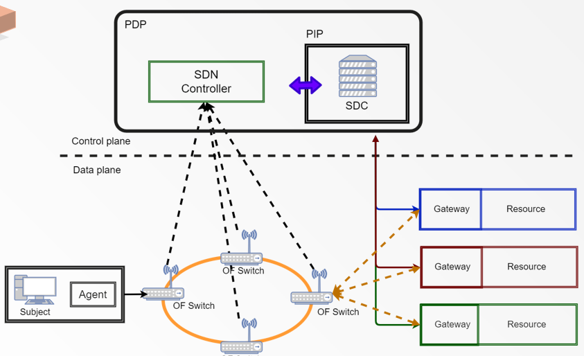

# 專案說明
專案的目標是POC零信任微分段結構，專案分成了ryu-dashboard(前端)、ryu-backend(後端)、ryu-project(Ryu SDN端)、gateway(各host端)
具體架構如下：


ryu-dashboard + ryu-backend = SDC(分段決策中心)
ryu-project (SDN Controller)

專案中還有一個custom_topo.py，會自動建立Mininet 連線以及其他初始設定

# branch 說明
本專案有兩個bracnh，一個有DB一個純粹使用json儲存資訊
主要是前者維護
* nginx 反向代理 :
[sdn](http://sdn.yuntech.poc.com/)
## 橋接方法
https://hackmd.io/Gph1uzqZSNOTftnL287tHg

## 環境變數說明
###  ryu-project
```
  VM_IP="192.168.173.19"   # 你開的VM
  USER_IP="192.168.173.28" # 你使用德電腦
  HOST1_IP="192.168.173.101" # host 1 
  HOST2_IP="192.168.173.102" # host 2 
  HOST3_IP="192.168.173.103"
  HOST4_IP="192.168.173.104"

  HOST1_MAC="00:00:00:00:00:01"
  HOST2_MAC="00:00:00:00:00:02"
  HOST3_MAC="00:00:00:00:00:03"
  HOST4_MAC="00:00:00:00:00:04"

  VM_MAC="08:00:27:a9:a6:9d"
  USER_MAC="08:00:27:3c:8f:0b"

  DPID="8796758451869" # swithc  DPID（Datapath ID）: key 值
```

###　ryu-backend
RPG 檔案名稱&路徑、會因為case不同而做切換

SDC URL記得去DNS 或 hosts上設置
```
  SDC_HOST=http://sdn.yuntech.poc.com  # SDC 的URL 
  WS_PORT=8765 # SDC 上web_socket port
  RPG_FILE=rpg_case_1.json # RPG 檔案名稱&路徑
```

## 專案執行前

清空以下紀錄

*  /ryu-project/config/acl_rules.txt
*  /ryu-backend/log.txt
*  /ryu-backend/intent.txt
*  /ryu-backend/dsl.txt

* 把 .19 、 .24 以外的規則全數刪除(怕刪不乾淨使用，這兩台IP 為你的VM IP 以及你的電腦IP)
```
ovs-ofctl dump-flows ovsbr0 | grep -E "nw_(src|dst)=" | grep -v "nw_src=192.168.173.19" | grep -v "nw_dst=192.168.173.19" | grep -v "nw_src=192.168.173.24" | grep -v "nw_dst=192.168.173.24" | while read line; do
    match=$(echo "$line" | sed -n 's/.* table=0, \(.*\) actions=.*/\1/p')
    echo "ovs-ofctl --strict del-flows ovsbr0 \"$match\""
    ovs-ofctl --strict del-flows ovsbr0 "$match"
done
```


## NGINX  
使用nginx-proxy manager

做前後端反向代理之用途
```
  docker compose build
  docker compose up -d 
```
http://localhost:81 可以看到預設介面


Python 環境 : conda test_env

先執行ryu-project 專案，這樣SDN Controller 就會成功執行
```
 ryu-manager app.py
```
接著啟動ryu-backend，此為DataCenter的後端
```
  python app.py
```

最後啟動前端介面 ryu-dashboard
```
  npm start
```

執行mininet 腳本，這腳本會建立Mininet 連線並且設定好一些前置作業
```
  python custom_topo.py
```

## 情境
1. 開發新的ERP模組，開發測試環境通過驗證，今天開始遷移上部屬正式提供服務

h1、h2 環境皆是測試環境(environment:testing)
h3、h4 環境則是生產環境(environment:production)

兩個環境無法透過TCP3306溝通，表示兩個獨立環境。
需求中h1的label會調整成production，觸發微分段邏輯，驗證h1可以與生產環境溝通

先執行 case/custom_topo_case1.py 建立host、初始化RPG 以及設定網路環境
接著執行intent_case_1.py 建立基本intent
最後執行intent_case_1_labelchange.py 把label 值做改變

## Gateway 

* 脫離業務意圖（Intent-based Violation）偵測

防止橫向移動的基礎邏輯

要安裝libnetfilter-queue 
```
  sudo apt update
  sudo apt install libnfnetlink-dev libnetfilter-queue-dev -y
```
攔截所有 TCP 入站 SYN 封包，送進 NFQUEUE 給 Python 處理
```
  sudo iptables -I INPUT -p tcp --syn -j NFQUEUE --queue-num 1
```

紀錄各host端傳送過來得連線
connection_logger.py (已整合至case3)

## 常用語法

* 查看流表規則
```
 ovs-ofctl dump-flows ovsbr0
```
* 刪除現有的所有流表規則
```
ovs-ofctl del-flows ovsbr0
```

* 用 nc 驗證TCP
```
  h2 nc -l -p 3306 > /tmp/h2_3306.log 2>&1 &
```


